\clearpage
# Introduction

During regular DNA sequencing, the sequences typically contain different suffixes that are prefixes to specific DNA sequences called adapter sequences. The suffixes of the sequences that contain parts of this adapter is called adapter fragments.

This project will explore different approaches to remove these adapter fragments, and is split into 5 main tasks, each of them focusing on different aspects of this process. The tasks are focused on finding efficient and accurate algorithms for this adapter sequence removal.

The report contains four main parts. The first part will explain and go though the main theories and algorithms that will be applied in the project. The results section will detail how these methods were used to solve each specific tasks, and the result of these solutions. The discussion section will explore how the results are affected by the proposed solution and wether they are viable or not, and offering alternative solutions that could have worked better. Finally there is a conclusion on how well this project managed to solve the tasks.

The end goal for the project was to create a preprocessor for constructing a sequence library from DNA fragments, where a set of sequences S are deconstructed, adapter sequences removed and similarities found.


\clearpage
# Methods

In order to explain my results and their relevance/accuracy i will first provide a general overview of the datastructures and algorithms i have applied and how they have been implemented.

## Suffix Trees

Suffix trees are one of the most common datastructures applied for string analysis. This is because of the suffix trees low time complexity for creation and search, and its wide range of applications.

A Suffix tree of a string consist of a root node where all of the children represent the start of a suffix in the string. This tree can then be used to efficiently search for suffixes and substrings.

Figure [@fig:suffix-banana] demonstrates how a SuffixTree can appear by using the word "banana". Notice how each leaf node ends with the character "$", this is done for later, in order to make sure a search string is an actual suffix, and not just a substring.

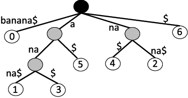{#fig:suffix-banana width=40%}

### Ukkonen's Algorithm

Ukkonen's Algorithm is an algorithm for creating a Suffix Tree in linear (*O(n)*) time complexity.

This is achieved by using "suffix-links" that connect internal nodes. When iterating through a string when creating the tree we are therefore able to, without searching the tree, add suffixes to all the nodes that need it WITHOUT searching through the tree. This is important as if we have to search through the tree to create it, the algorithm will have time complexity of *O(?)*. In addition to this each edge needs a unique key that can be checked in *O(1)* (this is typically a HashMap or similar), otherwise we run into the same problem again where we have to loop through existing children for a node, which in worst case would be the length of the alphabet used.

Another requirement for this time complexity is that all leaf nodes only contain the indices of that nodes substring, where it only has a reference to its end-index. This means that for every iteration all the leaf-nodes can be updated/extended in *O(1)*. My implementation is based on the explanation from Gobonamang[@ukkonen].


Ukkonen's Algorithm can be implemented as follows:

```java
createTree(string)
    create root node
    position = 0 // the end-index for leaf nodes
    activeNode = root
    activeEdge = none
    activeLength = 0
    remainder = 0

    for (character in string)
        position++ 
        remainder++
        while (remainder > 0)
            if (activeLength == 0) activeEdge = character;
            get current edge node
            if (current edge doesnt exist)
                insert new leaf from activeNode
                add suffix link if it exists to activeNode
            else
                if (active node has changed) continue
                if (character is already on our current edge)
                    // Dont need to change tree, suffix already exists
                    activeLength++
                    add suffix link if it exists to activeNode
                    break
                }
                split currentEdge
            }
            remainder--;
            if (activeNode is root && activeLength > 0)
                activeEdge = string.character[currentIndex - remainder + 1]
                activeLength--;
            else if (activeNode.suffixLink is not empty)
                activeNode = activeNode.suffixLink;
            else
                activeNode = root;
        }
    }
}
```
: Main part of Ukkonen's algorithm {#lst:ukk}

The methods for creating a new leaf and splitting a leaf are given in [@lst:ukk-insert-leaf] and [@lst:ukk-split]
```java
insertLeaf(parent)
    leaf = Node from currentIndex to position
    add leaf as child to parent
```
: Inserting a Leaf in Ukkonen's Algorithm {#lst:ukk-insert-leaf}

```java
split(Node)
    Create new internal node and add that as child to activeNode
    Create new leaf from the new internal node
    offset original start to account for its new parent
    add old node as child to the new internal node
    add suffix link if it exists to newInternalNode
```
: Splitting a node in Ukkonen's Algorithm {#lst:ukk-split}

And finally to check wether our active node has changed (if we have exhausted all characters in our currently active node) we have the following function (Code [@lst:ukk-change-active-node]).

```java
activeNode has changed(Node currentEdgeNode)
    if (currentEdgeNode.length > activeLength) return false
    activeEdge = string[activeNode.start + currentEdgeNode.length]
    activeLength -= currentEdgeNode.length
    activeNode = currentEdgeNode
    return true
```
: Check if active node has changed {#lst:ukk-change-active-node}

### Generalized Suffix Trees

An extension to regular suffix trees are **Generalized Suffix Trees**[@general-suffix-tree]. These trees are built in exactly the same way, but contain two or more words in the same tree, instead of just one. This mens that not only does the tree contain all suffixes for a string, but all suffixes for all the strings it represents. This allows for further improved searching when looking for shared substrings, suffixes or sequences between strings.

To find a shared suffix between two string, all you need to do is to create a generalized suffix tree for the string. Then look for leaf nodes that both/all strings end at. This is usually accomplished by using a unique suffix character for each string. An example of a generalized suffix tree is seen in [@fig:general-suffix-tree]. In the figure we can clearly see how the ABA and BAB are shared substrings between the two, and that they have no matching suffix because none of the leaf nodes directly contain both termination characters (in ths case they are "$0" and "$1").


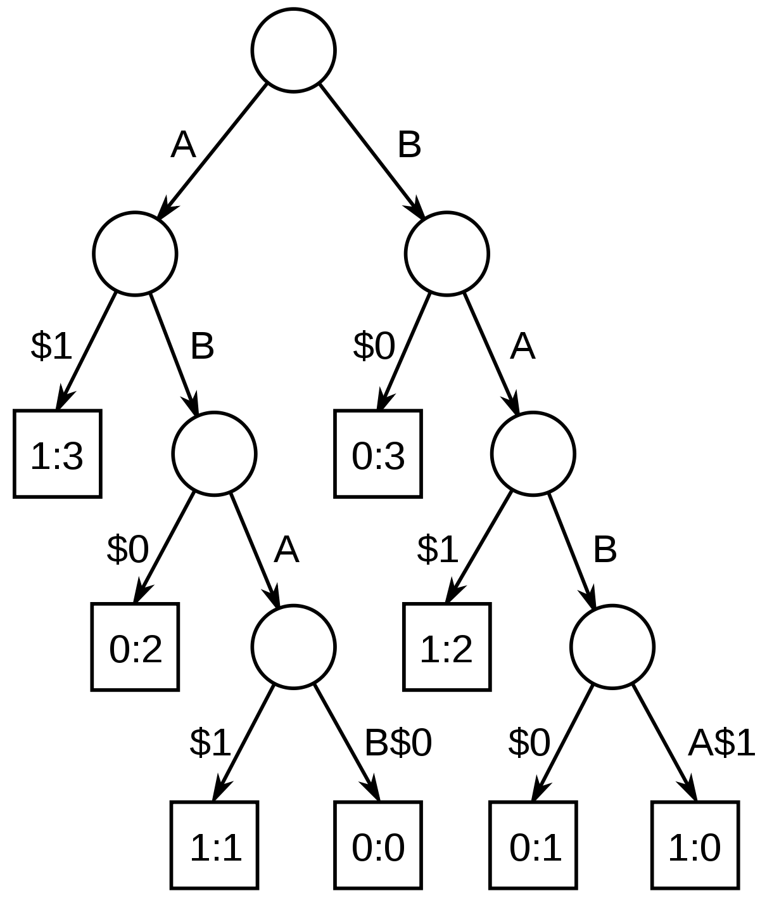{#fig:general-suffix-tree width=50%}


## Suffix-Prefix Matching

Suffix-Prefix matching is, quite simply, finding an overlap between two strings. For instance for the words "MONKEY" and "KEYCHAIN":

$$\begin{aligned}
MON&KEY\\
&KEYCHAIN
\end{aligned}$$

We can clearly see that the suffix of "MONKEY" matches the prefix of "KEYCHAIN". This is a suffix-prefix match of length 3, "KEY". For this project this is obviously relevant to find the suffixes that match a adapter sequence prefix.

### Perfect Matching

For perfect suffix-prefix matching the process is quite simple. By creating a suffix tree for the word with the suffix, we are able to traverse this tree , keeping track of all the valid suffixes as we move. If we reach a character that doesn't match, we return the longest suffix we found. This simple algorithm is shown in [@lst:perfect-match].

```java
find longest match(root of suffixtree, string with prefix)
    longest suffix match = 0
    index = 0
    while node = get child with key equal to string[index]
        index++
        while true
            if prefix is valid suffix
                longest suffix match = current length
            if node has no more characters
                break
             if reached end of suffix tree
                return longest match
            if character doesnt match
                return longest match
            index++

    return longest suffix match
```
: Finding Perfect Suffix-Prefix Match Algorithm {#lst:perfect-match}


### Imperfect Matching

When sequencing DNA, there is always a chance that some of the data is misread and/or wrong. For this reason it is often relevant to perform Imperfect Suffix-Prefix matching instead. This means that instead of the match having to be exactly the same, we allow a certain percentage of errors. If we take the previous example we can visualize this as.

$$\begin{aligned}
MON&KEY\\
&KEICHAIN
\end{aligned}$$

As before we can say we have a prefix-suffix match of length 3, but now it contains 33% mismatch. i.e. "KEI" and "KEY" is a match we hae a 33% error acceptance rate.


#### Types of errors and Edit Distance

Mismatching is not the only type of error that can occur though. In String comparison it is normal to talk about "Edit Distance" in the sense of "how many basic operations to go from one string to another". These basic operations are:

- Insertion: Adding a new character in the string.
- Deletion: Removing a character from the string.
- Substitution: Replacing a character with another.

 In the example given we have a substitution where "Y" is substituted with an "I". We could also say that we instead inserted a "Y" i front of the "I" and we would get the same match, but both of these instances only requires 1 basic operation.

##### Levenshtein

Levenshtein is a specific dynamic programming algorithm to find the Edit Distance between two strings. In it we take two strings and create a dynamic programming matrix that for each step, contains the minimum number of basic operations to go from one string to another. My implementation is partly based on the description from Wikipedia[@levenshtein].

```java
LevenshteinDistance(string A, string B)
    n, m = A.length+1 , B.length+1
    create dynamic programming table d of size n*m
    for i from 0 to m
        d[i, 0] = i
    for j from 0 to n
        d[0, j] = j
    for i from 1 to m
        for j from 1 to n
            cost = if s[i] = t[j] then 0 else 1
            d[i, j] = minimum(
                                d[i-1, j] + 1,    
                                d[i, j-1] + 1,     
                                d[i-1, j-1] + cost 
    return d[m, n]
```
: Levenshtein Algorithm {#lst:levenshtein}


## Finding Most Likely Adapter

One of the tasks (4), explores a situation where the adapter sequence itself is unknown. For this i created a very simple algorithm. The thought process behind this algorithm is that if we imagine all the characters except from the adapter to be random, then if we count the number of occurences for each character in each position, the character that appears most often should be the one from the adapter. Ofcourse this is a very crude algorithm and limitations of it are detailed in the discussion section. The algorithm itself is outlined in [@lst:counter-algorithm].

```java
process(set S of strings)
    for each string in S
        for each letter in the string
            increase count for that letter at its index
    
getMostLikely(index)
    highestCount = 0
    for character count at this index
        if (highestCount < count)
            highestCount = count
    return character with highest count

getResult()
    create string result   
    for index in highest number of indexes
        result[index] = getMostLikely(index)
    return result;
```
: Find most used character in each position of a set of strings {#lst:counter-algorithm}


\clearpage
# Results

Now lets see how these methods were, or could have been, used to solve each of the tasks.

## Task 1 - Perfectly matching adapter fragments

### Description

This task is focused on finding perfect suffix-prefix matches between a given adapter and a set of sequences S. Both the adapter and sequences in S contain letters from the alphabet "A, C, T, G and N". Where all the sequences in S have a starting length of 50 characters.

The task is to find cases where the suffix of the sequences in S match a prefix of the adapter and remove these from adapter fragments from the sequences. The result of this task is therefore a complete list of sequences with the perfect matches removed.

### Solution

To solve this task i created a single suffix tree using Ukkonen's algorithm on the reversed adapter, and then used this tree with the method described in [@lst:perfect-match] on the reversed sequences. The reason i reverse both the strings is to remove the need to create suffix trees for all the sequences, and instead only create it for the adapter. This is possible because if a prefix in A matches a suffix in B, then a suffix in reverse A will match the same prefix in reversed B. This is best demonstrated by an example, lets use the same as before:


$$\begin{aligned}
MON&KEY &- adapter\\
&KEYCHAIN &- sequence
\end{aligned}$$

$$\begin{aligned}
NIAHC&YEK &- sequence\\
&YEKNOM &- adapter
\end{aligned}$$

We see that we length of the match is exactly the same, and we know that the last three letters in MONKEY matches the first three letters in KEYCHAIN.

After applying this algorithm the length distribution of the sequences are seen in [@fig:res-perfect-match].

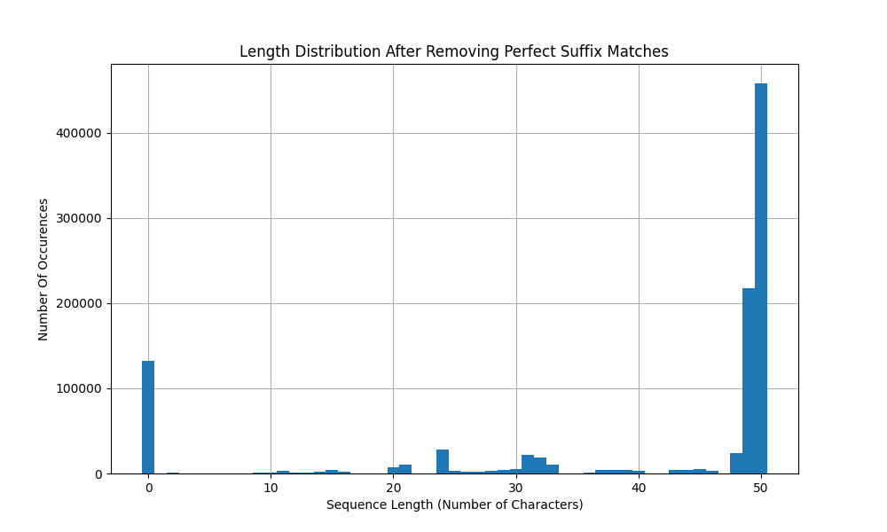{#fig:res-perfect-match width=\textwidth}

To keep track of the values for later, the two extremes of the distribution are listed in [@tbl:match-count-1]. In the table "Any Match" means any sequence with a match of at least 1 character (and now has length lower than 50), and "100% Match" means that the entire sequence matches the prefix of the adapter.

| Any Match | 100% Match |
|:---------:|:----------:|
|  542 046  |  132 149   |
: Number of Perfect Matches {#tbl:match-count-1}

Because of the linear time for creating the suffix tree, and the effectiveness of searching through this tree, the execution time for this algorithm is *O(n)* for creating the tree, where *n* is the length of the adapter, and *O(m)* for searching where *m* is the length of the sequence. To demonstrate this i ran the algorithm with longer and longer adapter and sequences to see how the length impacted the execution time. These results are shown in [@fig:res-1-times]. This time includes the creating of the tree and the search. For this, the adapter and all the sequences are randomly generated, which should give a even distribution of errors and matches. For each length the algorithm is applied to 10 000 different sequences, and the average of these times are what is displayed in the figure. This applies to all the other execution time figures as well.

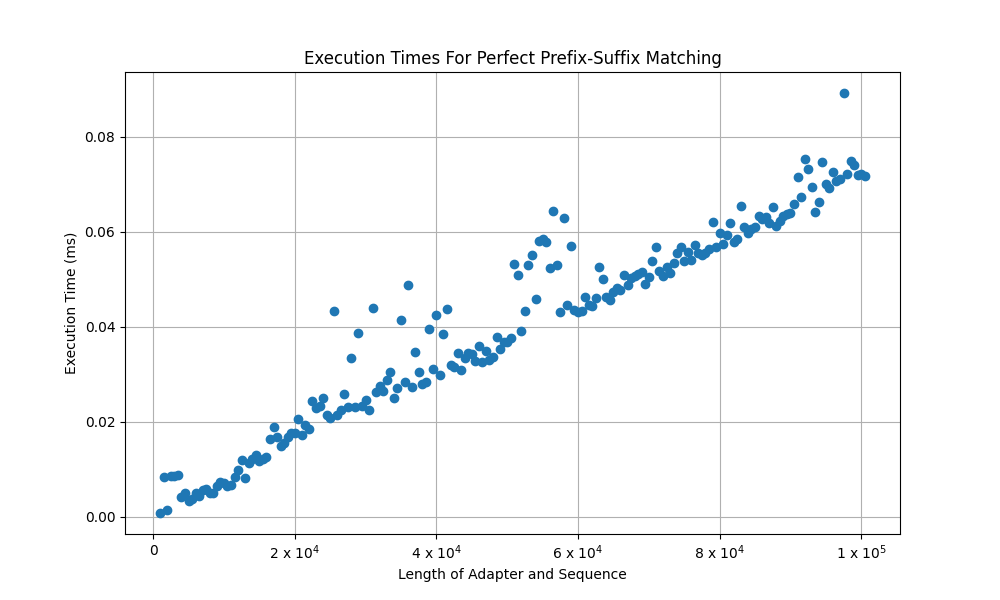{#fig:res-1-times width=\textwidth}

\clearpage
## Task 2 - Imperfectly matching adapter fragments

### Description

Now we are going to take the sequencing errors into consideration. The goal of this task is to perform the same analysis as in task 1, but this time we will allow up to a certain percentage of the returned suffix-prefix match to be wrong. This will first be done with only allowing substitution errors, and later expanded to allow insertions and deletions as well.

Lets look at an example. If we have the adapter "ACTGNACTGN" and the sequence "CAGAACCGNA" our previous algorithm would have found a match of length 1:

$$\begin{aligned}
&ACTGNACTGN & - adapter\\
CAGAACCGN&A & - sequence
\end{aligned}$$

But if we allow an error percentage of 20% we should find a match of length 6:

$$\begin{aligned}
&ACTGNACTGN & - adapter\\
CAGA&ACCGNA & - sequence
\end{aligned}$$

Where 1 out of the 6 characters are mismatched (an error percentage of 16,7%). Allowing insertions and deletions as well makes it possible for misaligned matches to be correct. Say if one of the sequences was "ACTGNACTGNN", and the error acceptance was 10%, it would not count this as a match, even though it is nearly identical to the adapter.

$$\begin{aligned}
&ACTGNACTGN & - adapter\\
ACTGNACTGNN& & - sequence
\end{aligned}$$

But this is easily fixed with a single deletion (which counts as a single error) and gives us the result (with 10%+ error acceptance) of:

$$\begin{aligned}
&ACTGNACTGN & - adapter\\
&ACTGNACTGN & - sequence
\end{aligned}$$


### Solution

To solve the first part of this problem i wanted to expand upon the method i used in the first task.

To allow for the errors i now, instead of just following the characters of the sequence, assume that all the characters could be wrong. I Therefore concluded that i needed to do a BFS (Breadth First Search) down the tree, and keep track of all the mismatches i encounter along the way. In other words i continue down all the branches of the tree until i either reach the end of that branch, or i encounter too many errors.

[@fig:res-2-10] and [@fig:res-2-25] show the length distribution after removing the adapter fragments with and error acceptance of 10% and 25%. While [@fig:res-2-10-vs-0] and [@fig:res-2-25-vs-10] show the relative difference of these disitrbutions (10% vs 0%, and 25% vs 10%).

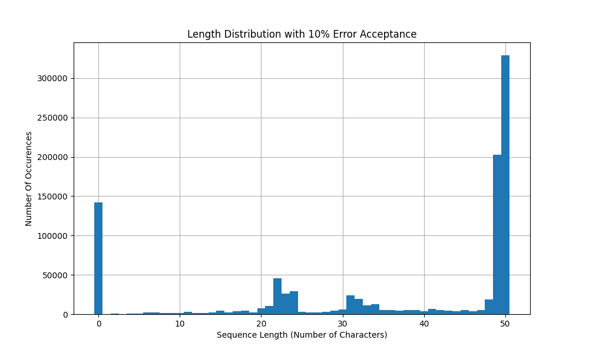{#fig:res-2-10 width=\textwidth}
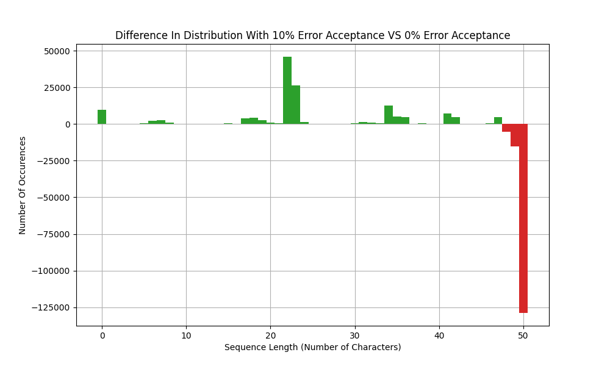{#fig:res-2-10-vs-0 width=\textwidth}

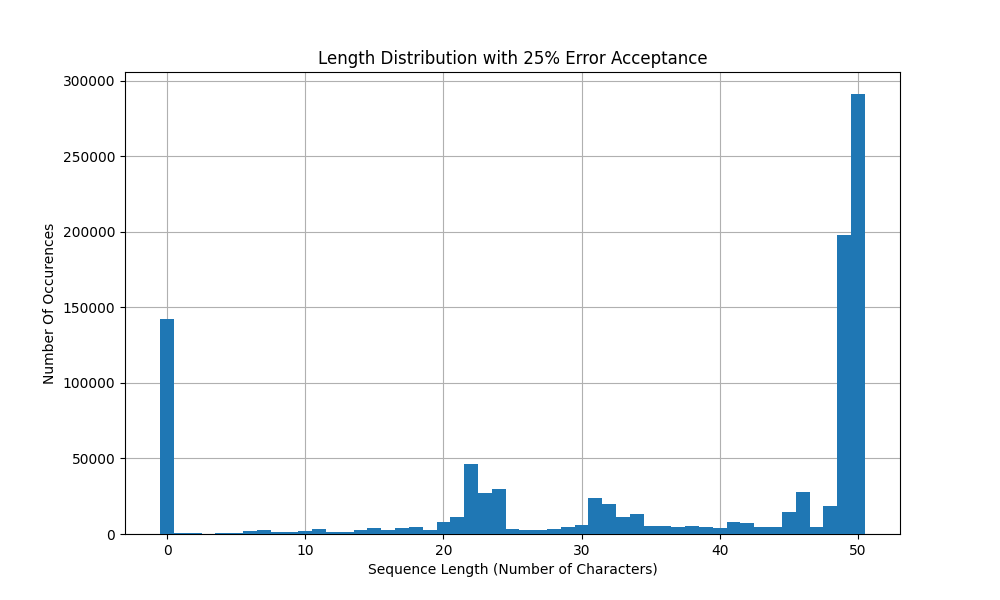{#fig:res-2-25 width=\textwidth}
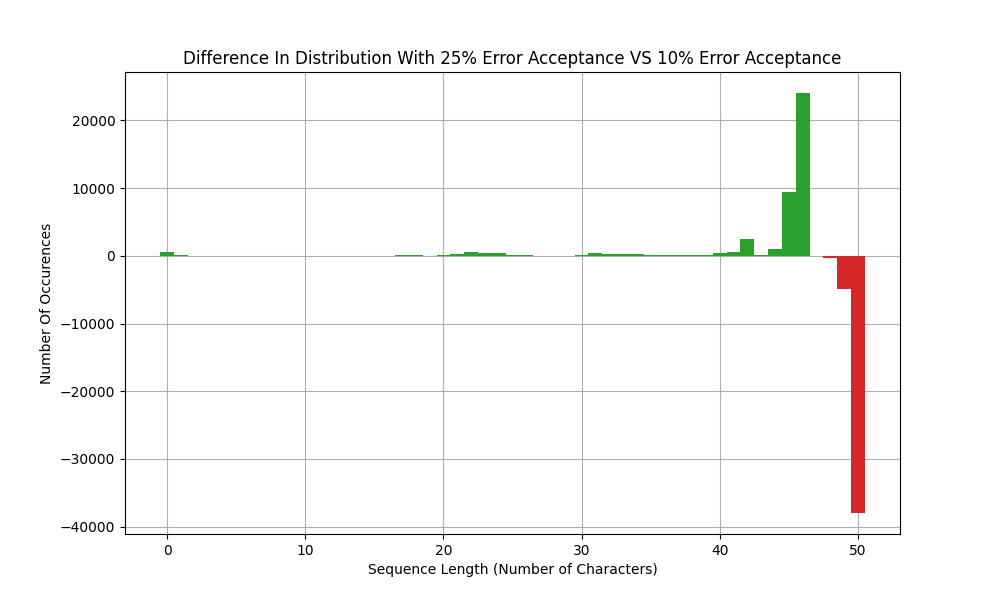{#fig:res-2-25-vs-10 width=\textwidth}

The number of matches with this approach is shown in [@tbl:matchcount-2]

|                                         | Any Match | 100% Match |
|:----------------------------------------|:---------:|:-----------|
| 10% Error                               |  670 918  | 141 997    |
| 25% Error                               |  708 896  | 142 569    |
: Number of matches with varying error acceptance for mismatches {#tbl:matchcount-2}

Ofcourse this extension comes with a cost, and that is execution time. Because we are performing a BFS our searching time complexity has gone up to *O(mk)* where *k* is the number of edges in our tree. However depending on the amount of errors we might be able to cut off certain branches sooner or later. This is demonstrated quite clearly in [@fig:res-2-times]. We clearly see how the worst case grows exponentially (because both *m* and *k* increase with longer adapters and sequences), while the "best case", where there are many errors early stays low and relatively similar to that of task 1.

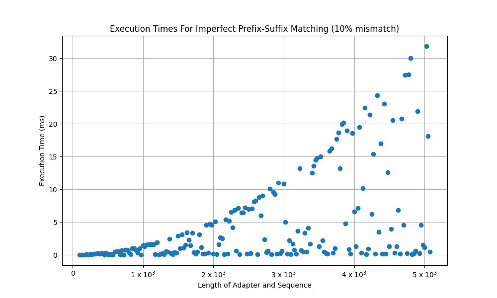{#fig:t2time width=\textwidth}

Ofcourse to allow insertion and deletion counting the mismatches themselves won't be enough. So for this i now calculate the Levenshtein distance at each point to find the number of operations to make the current suffix and prefix equal. The length distributions after using this approach is shown in [@fig:res-2-10-indel] and [@fig:res-2-25-indel]. Again the relative difference of these distributions vs without allowing insertions and deletions are shown in [@fig:res-2-10-10-indel] and [@fig:res-2-25-25-indel].

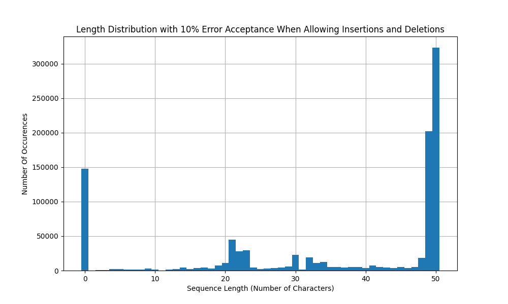{#fig:res-2-10-indel width=\textwidth}
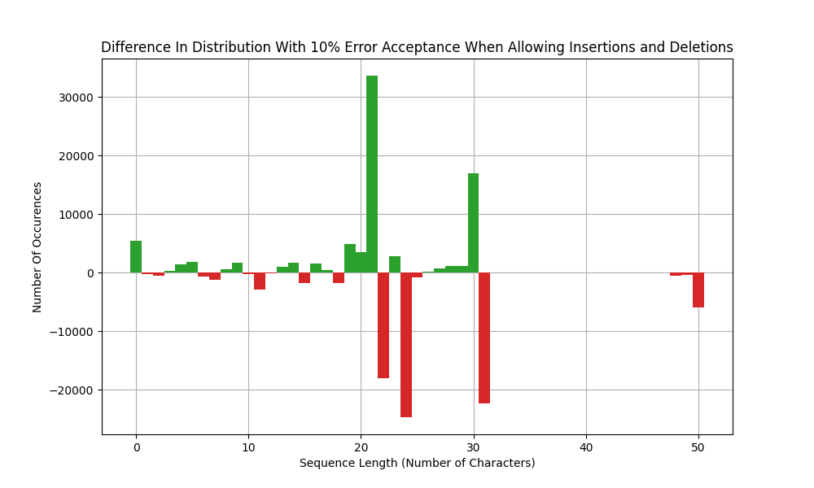{#fig:res-2-10-10-indel width=\textwidth}

{#fig:res-2-25-indel width=\textwidth}
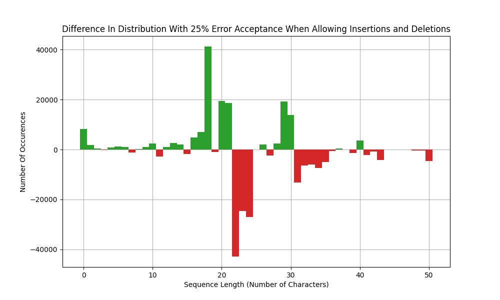{#fig:res-2-25-25-indel width=\textwidth}

Again, the number of matches with this approach is shown in [@tbl:matchcount-2-indel]

|                                         | Any Match | 100% Match |
|:----------------------------------------|:---------:|:-----------|
| 10% Error with Insertions and Deletions |  676 781  | 147 408    |
| 25% Error with Insertions and Deletions |  713 464  | 150 729    |
: Number of matches with varying error acceptance for mismatches {#tbl:matchcount-2-indel}

However these extra operations comes at a high cost in execution time, as shown in [@fig:t2time-indel]. Already at adapter and sequence lengths of 100, the algorithm uses (in worst case) up to 2,5ms per sequence, compared to the 0,06 ms for perfect sequence matching. For our set of 1 000 000 sequences of length 50, we can assume this approach will spend about 0,4ms per sequence for a total of $400 00ms=400s\approx 7$ minutes, if the sequences all had length of 100, this would be $\approx 42$ minutes for 1 000 000 sequences. For this algorithm the execution time gone up to a staggering *O($nm^2$)*.

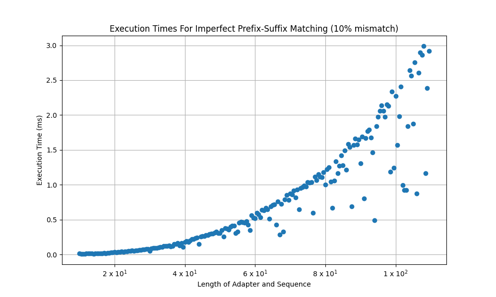{#fig:t2time-indel width=\textwidth}


\clearpage
## Task 3 - Sequencing Errors and error Distributions

From the previous tasks, the resulting match counts are shown in [@tbl:match-count]. This includes the relative difference (for 100% matches) in count and percent from the perfect matches for 10% error cases, and difference from 10% error for the 25% error cases.

|                                         | Any Match | 100% Match | Difference |     Percent      |
|:----------------------------------------|:---------:|:-----------|:----------:|:----------------:|
| Perfect Matches                         |  542 046  | 132 149    |            |                  |
| ---                                     |    ---    | ---        |    ---     |       ---        |
| 10% Error                               |  670 918  | 141 997    |   +9 848   | $\approx$ 6,94%  |
| 25% Error                               |  708 896  | 142 569    |   +  572   | $\approx$ 0.40%  |
| ---                                     |    ---    | ---        |    ---     |       ---        |
| 10% Error with Insertions and Deletions |  676 781  | 147 408    |  +15 259   | $\approx$ 10.35% |
| 25% Error with Insertions and Deletions |  713 464  | 150 729    |   +3 321   | $\approx$ 2.20%  |
: Number of Matches From Task 1 and Task 2 {#tbl:match-count}

To estimate the rate of sequencing errors i am using the count for 100% matches. This is because i imagine the sequences that match the adapter perfectly with only a few matches, were originally perfect matches but due to sequencing errors, no longer are. I am further assuming insertions and deletions are plausible errors so the numbers i will base my estimate on is the 10/25% errors with insertions and deletions.

From the number in [@tbl:match-count], we see that roughly 10% of the sequences in S contain some form of error. With 10% error acceptance, and a sequence length of 50, this means that 10% of the sequences contains up to 5 errors. This means we would expect the entre set S, contains roughly $500 000$ character errors of a total number of $50 000 000$ characters. In other words the rate of the number of sequencing errors per sequence is roughly **1 error per 2 sequences**, i.e. around **50%** of the sequences contains errors. Increasing the error acceptance by another 15% to 25% doesn't increase the number of 100% matches consideribly either, indicating that very few sequences contain more than this amount of errors.

From the length distributions we have looked at earlier though, we can see that the sequences that get longer when we allow errors, are not uniformelly distributed as we would expect. From the figures given in Task 2 we can clearly see most of the sequences has errors around the center of sequences.

I fact we could have taken only the sequences that are perfect matches with 10/25% error acceptance and try to perform the perfect matching on them instead, this way we could have seen exactly where these sequences had their *first* error and see if that would support the hypothesis. But due to time limitations this validation was not performed.


\clearpage
## Task 4 - Finding the adapater seqence

### Descritpion

In this task we are given a set of sequences without a known adapter, this means that in order for us to apply our preprocessor, we first have to estimate the adapter from all of the sequences.

### Solution

For this problem i opted to find a fast approach, so for this i used the counter algorithm described in [@lst:counter-algorithm]. In order to test this application i first tested the algorithm on the set and adapter from task 1 and 2 to see if i could find that adapter from those sequences, the result of this is in [@lst:control]. I also first did a baseline where i attempted to randomly guess the adapter, this is shown in [@lst:baseline].

```-
expected:       TGGAATTCTCGGGTGCCAAGGAACTCCAGTCACACAGTGATCTCGTATGCCGTCTTCTGCTTG
actual:         TGCCNTGCCCGGNCAGNAGCCTTGTANNTGTNTATGTNTAGCGATGAGAGCATNNNNNATGTC
matching:       TG---T-C-CGG-----A------T--------A-----A-C----A---C-T--------T- 
                25,4% Correct
```
: Randomly guessing the adapter {#lst:baseline}

As we can see, by just randomly guessing, abut 25% of the adapter is correct, so our implemented should be able to outperform this.

After using the algorithm we get the following result.

```-
expected:       TGGAATTCTCGGGTGCCAAGGAACTCCAGTCACACAGTGATCTCGTATGCCGTCTTCTGCTTG
actual:         TGGAATTGTTGAATGCCAAGGGCTTCCAGTCACAGAGTGTTCTAATATGC
matching:       TGGAATT-T-G--TGCCAAGG---TCCAGTCACA-AGTG-TCT--TATGC      
                78,0% Correct
```
: Testing the algorithm for sequences with known adapter {#lst:control}

We see that we actually manage to estimate the entire adapter with 78% accuracy.

Applying the algorithm on the set of sequences in 'tdt4287-unknown-adapter.txt' gives us the most likely adapter given in [@lst:uknown-adapter].

```-
TAAAGGATAAGCAGCCGACGTGGGGCGGGTCGAAAAGCGTTAGGATTACTGAGTAGATCGG-
-AAGAGCACACGTCTGAACTCCAGTCACGTAGAGATCTCGTATGCCGTCTTCTGCTTGAA
```
: Adapter found in 'tdt4287-unknown-adapter.txt' {#lst:uknown-adapter}

If we attempt to remove perfect matches for the adapter we found from the sequences we get the length distribution in [@fig:t4-length], [@fig:t4-length-comp] compares these lengths to the original lengths as these sequences no longer all had length 50, but lengths from 50 to 120.

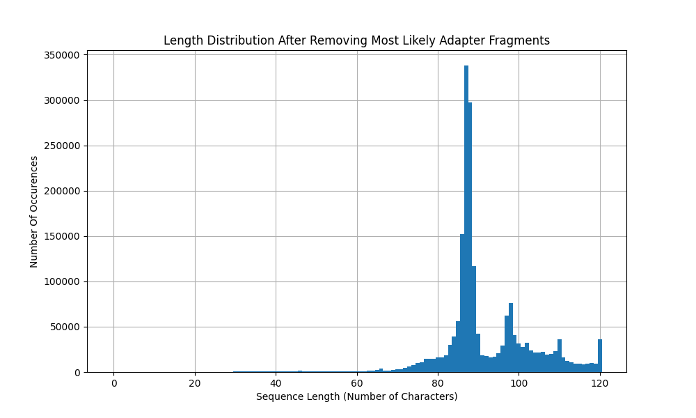{#fig:t4-length}

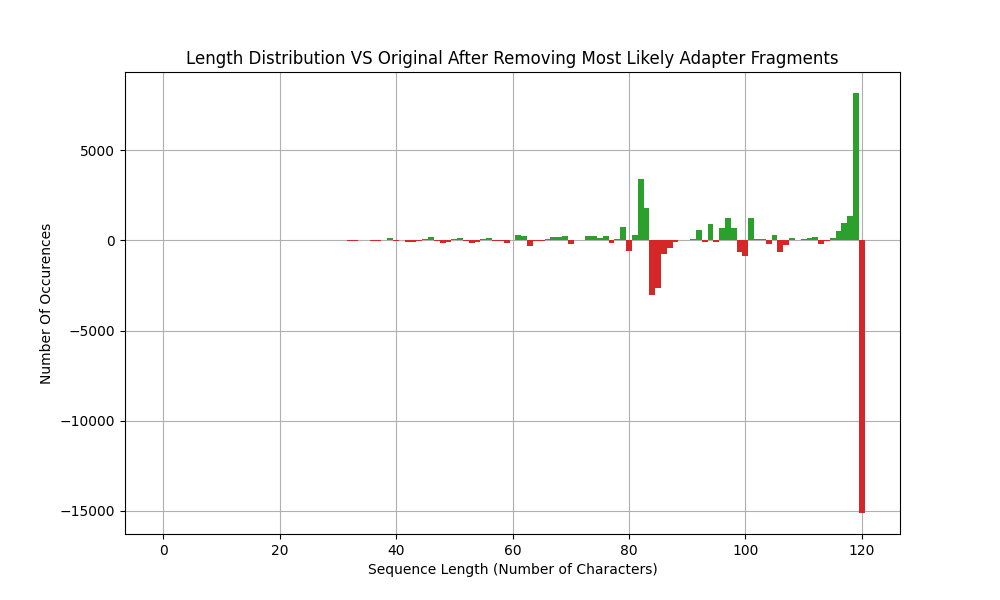{#fig:t4-length-comp}

Now because we use such a naive algorithm the execution time is very good, with an asymptotic running time of *O($nm$)* where *n* is the number of sequences to analyse and *m* is the length of the sequences. When testing the execution time for the algorithm we get the result from [@fig:t4-times].

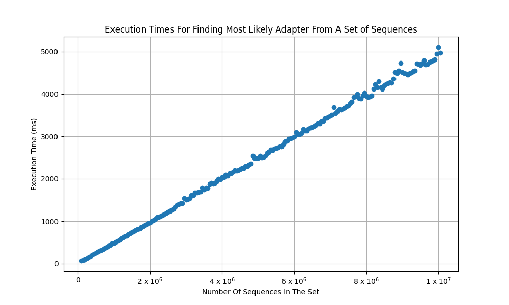{#fig:t4-times}


When applying the algorithm on 'Seqset3.txt' we get the adapter in [@lst:seqset-adapter]:

```-
CCCGGGGCGGGAAAGTTTGGGTTGGAAATCTCGGGGGCCAAAAAACCCCCC
```
: Adapter found in 'Seqset3.txt' {#lst:seqset-adapter}


\clearpage
# Discussion

## Perfectly matching adapter fragments

My algorithm for finding the perfectly matching adapter fragments performs quite well.

Other solutions to do this would ofcourse be to perform the same calculations without the suffix tree for the adapter, but this would mean comparing the same substring/suffix several times and increase the time complexity. So i believe the solution for this task is almost as efficient as it can get.

## Imperfectly matching adapter fragments

This problem is split into two parts, one with only mismatching and one with insertions and deletions as well. My solutions for these problems also have varying degrees of success.

Assuming the implementation is without bugs, the execution time for the simple BFS for finding the substrings with errors functions quite good, and has a reasonable execution time. The algorithm takes into account that the error percentage will change depending on how far the suffix is. Other approaches, like simply counting the errors up to a maximum might be faster, but will provide inaccurate and false results. For instance if you allow 5 errors in total, every sequence will have a match of at least length 5, even if there actually isn't any match.

When allowing insertions and deletions however my algorithm falls apart. This is mostly due to the way i incorperated the Levenshtein distance to calculate the number of errors. In my algorithm this is calculated from scratch for every step. This is obviously time consuming and uneccesery work. The correct way to this would have been to pass the dynamic programming matrix along, and continue expanding it, instead of recreating it every time. This could have reduces the time complexity to math that of normal error calculation. There might also be algorithms that find the longest suffix-prefix match without using the suffix tree at all. Using a edit-distance matrix it could be possible to find the longest viable suffix-prefix match under a certain distance directly from the matrix.

## Sequencing Errors and error Distributions

The results from my calculations seems a bit high compared to what sources are reporting as the normal sequencing error-rate. This might be due to the dataset itself, or it might be due to errors in my implementation. Either way i don't feel comfortable relying 100% on my results for this task, even though they represent the results i have.


## Finding the adapater seqence

The counter algorithm for finding the most likely adapter sequence has multiple downfalls. I created this algorithm as a time-squeeze attempt at getting some partly useful results, but it is quite clear to me that this isn't a viable solution to this problem for multiple reasons.

The first reason being that it is completely unable to find any more than one adapter/"suffix" from the set of sequences. It is therefore completely useless in finding other, alternative sequences in the same sequence set, as is asked for in both task 4 and 5.

Further, the algorithm does not even take into account if the characters are actual substrings or suffixes. This means that the algorithm will struggle if the dataset contains misaligned data, or insertion/deletion errors where the adapter doesn't perfectly match up to each other. I belie the reason i get a good percentage correct for the adapter in [@lst:control] is because i know (from the length distributions), that the adapter quite fills entire sequences (about 13% of all the sequences). If the dataset doesn't contain as high percentage of 100% matches however, the algorithm will not be any better than guessing the adapter randomly.

If i had more time i would have solved this task with generalized suffix trees instead. This would make it easier to find actual suffixes, and find common suffixes of certain length based on the number of sequences that contain each suffix. A problem with this approach would be the large amount of space the tree will take with such a high number of sequences. This could be remedied by pruning the tree and removing certain branches, but i would still e concerned about the size of the tree. Another option would to cr4ate multiple smaller trees, and then compare these with each other again. Lets say you split the dataset in three, and two of the trees report quite similar common sufffixes that would be a clear indication that those suffixes might be a part of the adapter.

## De-multiplex barcoded library

As a result of my implementation of the previous task, i was unable to find a algorithm for this task. This task is asking for answers to questions my algorithm cannot solve. That being finding multiple different common substrings.

A better solution to this would be to expand my desired solution from task 4. Creating a generalized suffix tree for all of the sequences, and for the barcodes, only look for substrings with starting indexes within a certain range in the original sequence, or relative to the adapter. In essence creating a more sophisticated suffix tree allowing for more specific querying and parameters. ofcoure this suffers from the same problems as i mentioned i Task 4, but this could be remedied by pruning the tree and branches that we know will not match any of our search criteria. This could be pruning branches of certain length, or not included branches before/after a certain index all together.


\clearpage
# Conclusion

In Conclusion believe i managed to find viable to solutions to task 1 and most of task 2, despite the execution time being horrendous when allowing insertions and deletions. This could be fixed even with my solution by incorporating the Levenshtein distance better.

For task 3 and estimating the rate of sequencing errors i am, as stated previously, a little hesitant about my results because the high number of errors. This could however be due to the dataset.

When searching for unknown adapters my algorithm performs OK at best, and only if the adapter is frequently used in the dataset. My implementation is therefore nothing to strive for, but was used because i was unable to create the more sophisticated, generalized suffix tree, algorithm i wanted for these tasks.

In total i am not satisfied with my preprocessor or algorithms i created as i am aware that several of them need improvements and/or faults.


\clearpage
# References{-}
